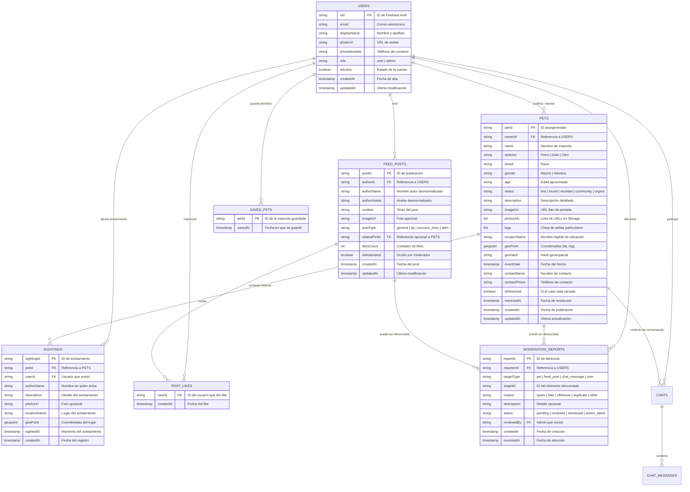

# Diseño de Base de Datos — Yago

Este documento define la arquitectura, modelo de datos, esquemas de colecciones, índices y políticas de seguridad para la base de datos de **Yago**, implementada sobre **Google Cloud Firestore** (NoSQL Document Database) en el proyecto Firebase `yago-21b28`.

---

## 1. Fundamentos y Decisiones de Arquitectura

### 1.1 Motor de Base de Datos: Cloud Firestore
* **Paradigma NoSQL orientado a documentos:** Permite estructuras jerárquicas flexibles (colecciones, documentos y subcolecciones), ideal para la sincronización móvil en tiempo real y modo sin conexión (offline persistence).
* **Escalabilidad y latencia:** Las consultas son proporcionales al tamaño del conjunto de resultados devuelto, no al tamaño total de la base de datos.
* **Integración nativa:** Vinculación directa con **Firebase Authentication** (`uid`), **Firebase Cloud Storage** (almacenamiento de fotos) y **Cloud Functions** (para triggers y tareas asíncronas).

### 1.2 Principio de Desnormalización Estratégica
En Cloud Firestore, para minimizar lecturas concurrentes y optimizar el rendimiento de la aplicación móvil (como las tarjetas `PetCard` en el feed y explorador), se aplican desnormalizaciones controladas:
* Nombres, avatares y teléfonos de contacto se copian en los documentos de reporte para visualización inmediata sin requerir queries adicionales (joins).
* Contadores atómicos (`likesCount`, `reportsCount`) gestionados mediante incrementos transaccionales (`FieldValue.increment`).

### 1.3 Estrategia Geoespacial Contextual
Para la visualización de la zona de extravío o último avistamiento en cada publicación de reporte (descartando el mapa interactivo global independiente en favor de visores contextuales por caso):
* Cada publicación de reporte almacena un `GeoPoint` nativo (`latitude`, `longitude`) con el punto de referencia y un radio estimado `zoneRadiusMeters` (ej: 500m - 1500m).
* Se incluye un campo descriptivo `locationName` (barrio/intersección legible) y opcionalmente un `geohash` (9 caracteres) para consultas por proximidad al domicilio del usuario sin sobrecargar el cliente móvil.

---

## 2. Diagrama Entidad - Relación (ERD Lógico)



---

## 3. Especificación Detallada de Colecciones

### 3.1 Colección `users`
* **Ruta:** `/users/{userId}`
* **Clave primaria (`documentId`):** `uid` generado por Firebase Authentication.
* **Propósito:** Almacenar perfil de usuario, configuración, estado de cuenta y rol de acceso.

| Campo | Tipo de Dato | Requerido | Descripción |
| :--- | :---: | :---: | :--- |
| `uid` | `String` | Sí | Mismo ID que `request.auth.uid`. |
| `email` | `String` | Sí | Correo electrónico validado. |
| `displayName` | `String` | Sí | Nombre y apellido visible en la comunidad. |
| `photoUrl` | `String?` | No | URL pública del avatar (Cloud Storage). |
| `phoneNumber` | `String?` | No | Teléfono de contacto para reclamos o alertas. |
| `role` | `String` | Sí | Rol de acceso: `'user'` o `'admin'` (ver `Roles.md`). |
| `isActive` | `Boolean` | Sí | Permite suspensión de cuentas por moderación. |
| `fcmTokens` | `Array<String>` | No | Tokens de dispositivos para notificaciones push FCM. |
| `stats` | `Map<String, Int>` | Sí | Métricas: `{ reportsCount: 0, resolvedCount: 0, petsCount: 0 }`. |
| `createdAt` | `Timestamp` | Sí | Fecha de registro inicial. |
| `updatedAt` | `Timestamp` | Sí | Fecha de última modificación del perfil. |

```json
// Ejemplo de documento en /users/uB89v2kLmN1
{
  "uid": "uB89v2kLmN1",
  "email": "sofia.garcia@example.com",
  "displayName": "Sofía García",
  "photoUrl": "https://storage.googleapis.com/.../avatars/uB89v2kLmN1.jpg",
  "phoneNumber": "+54 11 4455-6677",
  "role": "user",
  "isActive": true,
  "fcmTokens": ["f_d9A0xK19q..."],
  "stats": {
    "reportsCount": 2,
    "resolvedCount": 1,
    "petsCount": 1
  },
  "createdAt": "2026-03-01T12:00:00Z",
  "updatedAt": "2026-03-05T15:30:00Z"
}
```

---

### 3.2 Subcolección `users/{userId}/saved_pets` (Guardados / Favoritos)
* **Ruta:** `/users/{userId}/saved_pets/{petId}`
* **Clave primaria (`documentId`):** `petId` (ID de la mascota guardada).
* **Propósito:** Registro personal de publicaciones que el usuario marcó con el botón de marcador (bookmark) para seguimiento rápido.

| Campo | Tipo de Dato | Requerido | Descripción |
| :--- | :---: | :---: | :--- |
| `petId` | `String` | Sí | ID del reporte guardado. |
| `savedAt` | `Timestamp` | Sí | Marca temporal de guardado. |

---

### 3.3 Colección `pets` (Reportes de Mascotas)
* **Ruta:** `/pets/{petId}`
* **Clave primaria (`documentId`):** Autogenerado por Firestore (alfanumérico único de 20 caracteres).
* **Propósito:** Contiene todas las publicaciones de mascotas: perdidas (`lost`), encontradas (`found`), reunidas (`reunited`) o comunitarias (`community`). Alimenta el feed, las tarjetas `PetCard`, el mapa `PetMapTab` y la ficha `PetDetailScreen`.

| Campo | Tipo de Dato | Requerido | Descripción |
| :--- | :---: | :---: | :--- |
| `id` | `String` | Sí | Identificador único del reporte (coincide con el Document ID). |
| `ownerId` | `String` | Sí | `uid` del usuario que publicó el reporte. |
| `name` | `String` | Sí | Nombre de la mascota (o `'Sin nombre / Encontrado'` si aplica). |
| `species` | `String` | Sí | Especie: `'Perro'`, `'Gato'`, `'Otro'`. |
| `breed` | `String` | Sí | Raza (ej: `'Golden Retriever'`, `'Mestizo'`, `'Siamés'`). |
| `gender` | `String` | Sí | Sexo: `'Macho'`, `'Hembra'`, `'Desconocido'`. |
| `age` | `String` | Sí | Edad o etapa (ej: `'2 años'`, `'Cachorro'`, `'Adulto'`). |
| `status` | `String` | Sí | Enum de estado: `'lost'`, `'found'`, `'reunited'`, `'community'`, `'urgent'`. |
| `description` | `String` | Sí | Narrativa detallada de lo sucedido o características particulares. |
| `imageUrl` | `String` | Sí | URL principal para miniaturas y tarjetas (`PetCard`). |
| `photoUrls` | `Array<String>` | Sí | Lista con todas las fotografías subidas a Cloud Storage. |
| `tags` | `Array<String>` | Sí | Etiquetas para chips (ej: `["Collar rojo", "Con chip", "Mancha blanca"]`). |
| `locationName` | `String` | Sí | Dirección o barrio legible (ej: `'Palermo, CABA'`). |
| `geoPoint` | `GeoPoint` | Sí | Coordenadas exactas (`latitude: -34.5889, longitude: -58.4306`). |
| `geohash` | `String` | Sí | Cadena geohash para indexado espacial (precisión recomendada: 9 caracteres). |
| `eventDate` | `Timestamp` | Sí | Fecha y hora en la que se extravió o fue encontrada. |
| `contactName` | `String` | Sí | Nombre de contacto desnormalizado para contacto directo. |
| `contactPhone` | `String` | Sí | Teléfono para llamadas o WhatsApp desde `PetDetailScreen`. |
| `isResolved` | `Boolean` | Sí | `true` si la mascota volvió a casa o fue adoptada/reclamada. |
| `resolvedAt` | `Timestamp?` | No | Fecha en que se marcó el reencuentro. |
| `isModerated` | `Boolean` | Sí | `true` si fue dada de baja u ocultada por un Administrador. |
| `viewsCount` | `Int` | Sí | Cantidad de visualizaciones en la ficha. |
| `sightingsCount` | `Int` | Sí | Cantidad de aportes de avistamiento registrados. |
| `createdAt` | `Timestamp` | Sí | Fecha de publicación en la plataforma. |
| `updatedAt` | `Timestamp` | Sí | Fecha de última edición. |

```json
// Ejemplo de documento en /pets/pet_89a71b29d
{
  "id": "pet_89a71b29d",
  "ownerId": "uB89v2kLmN1",
  "name": "Luna",
  "species": "Perro",
  "breed": "Lhasa Apso",
  "gender": "Hembra",
  "age": "3 años",
  "status": "lost",
  "description": "Se asustó con fuegos artificiales en Plaza Armenia y corrió hacia Honduras. Lleva collar rojo con chapita.",
  "imageUrl": "https://storage.googleapis.com/yago-21b28.appspot.com/pets/luna_cover.jpg",
  "photoUrls": [
    "https://storage.googleapis.com/yago-21b28.appspot.com/pets/luna_cover.jpg",
    "https://storage.googleapis.com/yago-21b28.appspot.com/pets/luna_back.jpg"
  ],
  "tags": ["Collar rojo", "Con chip", "Asustadiza"],
  "locationName": "Palermo, CABA",
  "geoPoint": {
    "_latitude": -34.5889,
    "_longitude": -58.4306
  },
  "geohash": "69y7pu28z",
  "eventDate": "2026-03-08T18:30:00Z",
  "contactName": "Sofía García",
  "contactPhone": "+54 11 4455-6677",
  "isResolved": false,
  "resolvedAt": null,
  "isModerated": false,
  "viewsCount": 142,
  "sightingsCount": 2,
  "createdAt": "2026-03-08T19:00:00Z",
  "updatedAt": "2026-03-09T08:15:00Z"
}
```

---

### 3.4 Subcolección `pets/{petId}/sightings` (Avistamientos)
* **Ruta:** `/pets/{petId}/sightings/{sightingId}`
* **Clave primaria (`documentId`):** Autogenerado.
* **Propósito:** Permitir a los miembros de la comunidad registrar pistas o avistamientos de una mascota perdida sin invadir la descripción original.

| Campo | Tipo de Dato | Requerido | Descripción |
| :--- | :---: | :---: | :--- |
| `id` | `String` | Sí | ID del avistamiento. |
| `petId` | `String` | Sí | ID de la mascota asociada. |
| `userId` | `String` | Sí | `uid` del usuario que reportó haberla visto. |
| `authorName` | `String` | Sí | Nombre del informante. |
| `authorPhone` | `String?` | No | Teléfono de contacto opcional. |
| `description` | `String` | Sí | Detalle del avistamiento (ej: "La vi corriendo cerca de Scalabrini Ortiz"). |
| `photoUrl` | `String?` | No | Foto opcional tomada al momento del avistamiento. |
| `locationName` | `String` | Sí | Lugar aproximado. |
| `geoPoint` | `GeoPoint` | Sí | Coordenadas del punto avistado. |
| `sightedAt` | `Timestamp` | Sí | Hora aproximada en que se vio al animal. |
| `createdAt` | `Timestamp` | Sí | Hora en que se envió el formulario. |

---

### 3.5 Colección `feed_posts` (Publicaciones Comunitarias)
* **Ruta:** `/feed_posts/{postId}`
* **Clave primaria (`documentId`):** Autogenerado.
* **Propósito:** Soporta el feed social y comunitario de Yago (historias de reencuentros, avisos de adopción responsable, consejos comunitarios, fotos cotidianas).

| Campo | Tipo de Dato | Requerido | Descripción |
| :--- | :---: | :---: | :--- |
| `id` | `String` | Sí | ID de la publicación. |
| `authorId` | `String` | Sí | `uid` del autor. |
| `authorName` | `String` | Sí | Nombre del usuario visible. |
| `authorAvatar` | `String?` | No | Foto de perfil del autor desnormalizada. |
| `content` | `String` | Sí | Texto de la publicación. |
| `imageUrl` | `String?` | No | Imagen adjunta opcional en Cloud Storage. |
| `postType` | `String` | Sí | Tipo: `'general'`, `'tip'`, `'success_story'`, `'adoption'`, `'alert'`. |
| `relatedPetId` | `String?` | No | Referencia opcional a un documento en `/pets` si relata un reencuentro. |
| `likesCount` | `Int` | Sí | Contador atómico de 'me gusta'. |
| `isModerated` | `Boolean` | Sí | Oculto si fue penalizado por administración. |
| `createdAt` | `Timestamp` | Sí | Fecha de creación. |
| `updatedAt` | `Timestamp` | Sí | Fecha de última edición. |

---

### 3.6 Subcolección `feed_posts/{postId}/likes`
* **Ruta:** `/feed_posts/{postId}/likes/{userId}`
* **Clave primaria (`documentId`):** `userId` (`request.auth.uid`).
* **Propósito:** Evitar colisiones de concurrencia al registrar un "me gusta" y permitir verificar en tiempo constante $O(1)$ si el usuario activo ya dio like (`isLiked`).

| Campo | Tipo de Dato | Requerido | Descripción |
| :--- | :---: | :---: | :--- |
| `userId` | `String` | Sí | ID del usuario. |
| `createdAt` | `Timestamp` | Sí | Marca temporal de la reacción. |

---

### 3.7 Colección `moderation_reports` (Denuncias y Moderación)
* **Ruta:** `/moderation_reports/{reportId}`
* **Clave primaria (`documentId`):** Autogenerado.
* **Propósito:** Permite a los usuarios denunciar contenido ofensivo, spam o perfiles fraudulentos, y proporciona a los administradores una bandeja centralizada de moderación según lo estipulado en `Roles.md`.

| Campo | Tipo de Dato | Requerido | Descripción |
| :--- | :---: | :---: | :--- |
| `id` | `String` | Sí | ID del reporte de moderación. |
| `reporterId` | `String` | Sí | `uid` del usuario denunciante. |
| `targetType` | `String` | Sí | Elemento: `'pet'`, `'feed_post'`, `'chat_message'`, `'user'`. |
| `targetId` | `String` | Sí | Document ID del elemento reportado. |
| `reason` | `String` | Sí | Motivo: `'spam'`, `'fake'`, `'offensive'`, `'duplicate'`, `'other'`. |
| `description` | `String?` | No | Explicación detallada del denunciante. |
| `status` | `String` | Sí | Estado del caso: `'pending'`, `'reviewed'`, `'dismissed'`, `'action_taken'`. |
| `reviewedBy` | `String?` | No | `uid` del administrador que procesó la denuncia. |
| `createdAt` | `Timestamp` | Sí | Fecha de la denuncia. |
| `resolvedAt` | `Timestamp?` | No | Fecha de resolución del caso. |

---

### 3.8 Colección `chats` (Conversaciones Directas 1 a 1)
* **Ruta:** `/chats/{chatId}`
* **Clave primaria (`documentId`):** Autogenerado o compuesto (`uid1_uid2`).
* **Propósito:** Agrupa las conversaciones privadas entre dos usuarios para coordinar el reencuentro de una mascota o brindar información de avistamiento.

| Campo | Tipo de Dato | Requerido | Descripción |
| :--- | :---: | :---: | :--- |
| `id` | `String` | Sí | ID de la conversación. |
| `participantIds` | `Array<String>` | Sí | Lista con los UIDs de los dos participantes `[uid1, uid2]`. |
| `participantDetails` | `Map<String, Map>` | Sí | Snapshot desnormalizado con `{ displayName, photoUrl }` por UID para lectura instantánea en la bandeja. |
| `relatedPetId` | `String?` | No | ID del reporte de mascota que originó el contacto. |
| `relatedPetName` | `String?` | No | Nombre de la mascota vinculada. |
| `relatedPetImage` | `String?` | No | Miniatura de la mascota vinculada. |
| `lastMessage` | `String` | Sí | Texto del último mensaje enviado. |
| `lastMessageSenderId` | `String` | Sí | UID de quien envió el último mensaje. |
| `lastMessageAt` | `Timestamp` | Sí | Fecha y hora del último mensaje (utilizado para ordenar la bandeja). |
| `unreadCount` | `Map<String, Int>` | Sí | Conteo de mensajes no leídos por cada participante: `{ uid1: 0, uid2: 1 }`. |
| `createdAt` | `Timestamp` | Sí | Fecha de creación del chat. |

---

### 3.9 Subcolección `chats/{chatId}/messages` (Mensajes de Chat)
* **Ruta:** `/chats/{chatId}/messages/{messageId}`
* **Clave primaria (`documentId`):** Autogenerado.
* **Propósito:** Almacena los mensajes individuales intercambiados en una conversación.

| Campo | Tipo de Dato | Requerido | Descripción |
| :--- | :---: | :---: | :--- |
| `id` | `String` | Sí | ID del mensaje. |
| `senderId` | `String` | Sí | UID del emisor del mensaje. |
| `text` | `String` | Sí | Contenido textual del mensaje. |
| `imageUrl` | `String?` | No | Foto opcional adjunta enviada por el usuario (ej: foto del avistamiento). |
| `isRead` | `Boolean` | Sí | Estado de lectura por el receptor. |
| `sentAt` | `Timestamp` | Sí | Fecha y hora de emisión del mensaje. |

---

## 4. Índices Compuestos Necesarios

Para soportar los filtros rápidos del feed, la búsqueda reactiva y la clasificación cronológica, Firestore requiere los siguientes **índices compuestos**:

| Colección | Campos y Orden | Tipo de Consulta |
| :--- | :--- | :--- |
| `pets` | `status` (ASC), `createdAt` (DESC) | Pestañas del feed (*Perdidas*, *Encontradas*, etc.) ordenadas por novedad. |
| `pets` | `species` (ASC), `status` (ASC), `createdAt` (DESC) | Búsqueda filtrando por especie de animal y estado de extravío. |
| `pets` | `ownerId` (ASC), `createdAt` (DESC) | Pestaña de perfil para ver "Mis Reportes" cronológicamente. |
| `pets` | `isModerated` (ASC), `status` (ASC), `createdAt` (DESC) | Exclusión automática de reportes dados de baja en el feed público. |
| `feed_posts` | `isModerated` (ASC), `createdAt` (DESC) | Muro comunitario ordenado del más reciente al más antiguo. |
| `moderation_reports` | `status` (ASC), `createdAt` (DESC) | Bandeja de entrada para el rol Administrador. |

---

## 5. Reglas de Seguridad (`firestore.rules`)

A continuación se detalla la configuración recomendada de reglas de seguridad para Firestore, garantizando que los usuarios solo editen sus propios datos y los administradores tengan permisos de moderación globales:

```javascript
rules_version = '2';
service cloud.firestore {
  match /databases/{database}/documents {
    
    // Funciones auxiliares de verificación
    function isAuthenticated() {
      return request.auth != null;
    }

    function isOwner(userId) {
      return isAuthenticated() && request.auth.uid == userId;
    }

    function isAdmin() {
      return isAuthenticated() && 
        get(/databases/$(database)/documents/users/$(request.auth.uid)).data.role == 'admin';
    }

    // --- Colección: users ---
    match /users/{userId} {
      // Lectura pública de perfiles básicos
      allow read: if isAuthenticated();
      // Creación al registrarse
      allow create: if isOwner(userId);
      // Solo el propio usuario puede editar su perfil (y no puede autoasignarse rol admin)
      allow update: if isOwner(userId) && (!request.resource.data.diff(resource.data).affectedKeys().hasAny(['role', 'isActive']))
                    || isAdmin();
      // Guardados personales
      match /saved_pets/{petId} {
        allow read, write: if isOwner(userId);
      }
    }

    // --- Colección: pets ---
    match /pets/{petId} {
      // Lectura pública para cualquier usuario autenticado (si no está moderado o si es el dueño/admin)
      allow read: if isAuthenticated() && (resource.data.isModerated == false || isOwner(resource.data.ownerId) || isAdmin());
      // Creación si está autenticado y asigna su propio UID como ownerId
      allow create: if isAuthenticated() && request.resource.data.ownerId == request.auth.uid;
      // Modificación por el dueño o por un Administrador
      allow update: if isOwner(resource.data.ownerId) || isAdmin();
      // Baja por el dueño o Administrador
      allow delete: if isOwner(resource.data.ownerId) || isAdmin();

      // Subcolección: sightings
      match /sightings/{sightingId} {
        allow read: if isAuthenticated();
        allow create: if isAuthenticated() && request.resource.data.userId == request.auth.uid;
        allow update, delete: if isOwner(resource.data.userId) || isAdmin();
      }
    }

    // --- Colección: feed_posts ---
    match /feed_posts/{postId} {
      allow read: if isAuthenticated() && (resource.data.isModerated == false || isAdmin());
      allow create: if isAuthenticated() && request.resource.data.authorId == request.auth.uid;
      allow update, delete: if isOwner(resource.data.authorId) || isAdmin();

      // Subcolección: likes
      match /likes/{userId} {
        allow read: if isAuthenticated();
        allow write: if isOwner(userId);
      }
    }

    // --- Colección: moderation_reports ---
    match /moderation_reports/{reportId} {
      // Los usuarios pueden crear denuncias
      allow create: if isAuthenticated() && request.resource.data.reporterId == request.auth.uid;
      // Solo administradores pueden leer y resolver denuncias
      allow read, update, delete: if isAdmin();
    }
  }
}
```

---

## 6. Correspondencia entre Modelos Dart y Documentos Firestore

Para facilitar la transición desde los mocks en memoria (`MockDataService`) hacia Firestore en `lib/services/`, se establece la correspondencia directa de tipos:

| Modelo Dart (`lib/models/`) | Colección Firestore | Métodos de Conversión |
| :--- | :--- | :--- |
| `Pet` (`pet.dart`) | `/pets` | `Pet.fromFirestore(DocumentSnapshot doc)` y `Map<String, dynamic> toFirestore()` |
| `YagoPetStatus` (Enum) | `status` (String) | Serialización de nombres: `'lost'`, `'found'`, `'reunited'`, `'community'`, `'urgent'` |
| `FeedPost` (`feed_post.dart`) | `/feed_posts` | `FeedPost.fromFirestore(DocumentSnapshot doc)` y `Map<String, dynamic> toFirestore()` |
| Perfil de Usuario | `/users` | `UserModel.fromFirestore(DocumentSnapshot doc)` |

---

## 7. Próximos Pasos de Implementación

1. **Configuración de índices en Firebase Console:** Desplegar o crear los índices compuestos listados en la Sección 4 mediante `firestore.indexes.json` o la CLI de Firebase (`firebase deploy --only firestore:indexes`).
2. **Aplicación de reglas de seguridad:** Guardar las reglas de la Sección 5 en el archivo `firestore.rules` del proyecto e implementarlas vía Firebase CLI.
3. **Creación de `PetFirestoreService`:** Desarrollar el servicio que reemplace gradualmente a `MockDataService`, implementando operaciones CRUD (`Stream<List<Pet>>`, `Future<void> addPet(...)`, `Future<void> updatePetStatus(...)`).
